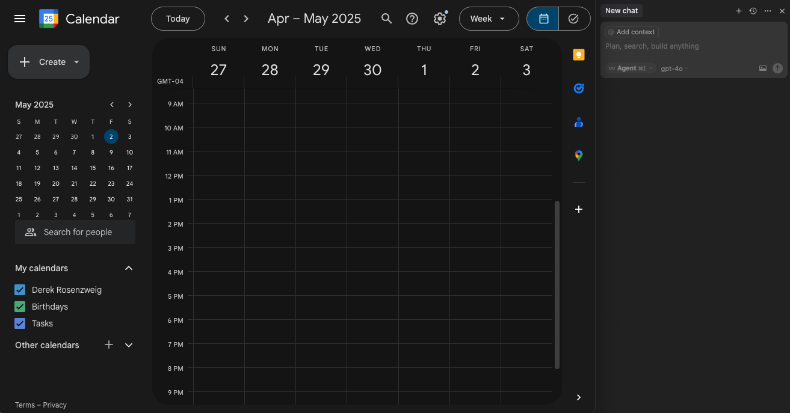

# Chronologue: Calendar-Grounded Memory and Agent Interface 

[](https://developers.google.com/calendar)
[](https://datatracker.ietf.org/doc/html/rfc5545)
[](https://opensource.org/licenses/Apache-2.0)
[](https://github.com/modelcontextprotocol)

**Documentation** → [chronologue.ai](https://chronologue.ai)

## Table of Contents

- [Overview](#overview)
- [Getting Started](#getting-started)
- [Clone and Setup](#clone-and-setup)
- [Install Dependencies](#install-dependencies)
- [Set Up Environment](#set-up-environment)
- [Core Commands](#core-commands)
  - [JSON ↔ ICS Conversion](#json--ics-conversion)
  - [MCP Server](#mcp-server)
  - [Streamlit Interface](#streamlit-interface)
- [Sample Workflow](#sample-workflow)
- [Prototype: Cursor Calendar Copilot](#prototype-cursor-calendar-copilot)
- [Documentation](#-documentation)
- [License](#license)
- [Contact](#contact)


## Overview

Chronologue transforms memory—such as conversation history—into calendar-grounded interfaces for agents and users. By bridging natural language, structured memory, and scheduling, it enables agents to operate over time while giving users a familiar, editable interface to steer behavior and planning.


> *“Memory of user context conditions the future distribution of responses that a language model will sample from.”*
>
> *“We make ourselves intelligent by designing environments that make relevant information accessible to our future selves.”*  
> — [Donald Norman](https://jnd.org/)
>
> *“Time is a core substrate for intelligent behavior.”*


## Getting Started 


### Install `uv`


```bash
curl -LsSf https://astral.sh/uv/install.sh | sh
```

### Clone and Setup 

```bash
git clone https://github.com/dr2633/chronologue
cd chronologue
uv init
uv venv
source .venv/bin/activate
```

## Install Dependencies 

```bash
uv pip install -r requirements.txt
uv add "mcp[cli]" httpx
```

If developing in MCP locally: 

```bash
brew install node
```

## Set Up Environment 

Add .env and set your API keys and Google Workspace credentials: 

```
OPENAI_API_KEY=your-openai-key
CLAUDE_API_KEY=your-anthropic-key
GEMINI_API_KEY=your-gemini-key
GOOGLE_CLIENT_CREDENTIALS=calendar/credentials.json
GOOGLE_TOKEN_FILE=calendar/token.json
```

Follow the [Google Calendar API setup guide](calendar/google_API_setup.md) to enable calendar sync.

## Core Scripts 

#### JSON ↔ ICS Conversion

```bash
python modules/export_calendar.py        # JSON → ICS
python modules/import_calendar.py        # ICS → JSON
python modules/embeddings.py        # Generate embeddings for retrieval
```

#### Run MCP Server 

```bash
mcp dev mcp/server-verifier.py
mcp dev mcp/server_calendar.py
mcp dev mcp/server_google_calendar.py
```

#### Streamlit Chat Editor Interface 

```bash
streamlit run modules/streamlit_chat_editor.py
```


#### Sample Workflow 

Model Output → `.ics` Calendar Format

```json
{
  "title": "Project Sync: Inference Pipeline",
  "description": "Check progress on GPU inference benchmarks.",
  "start": "2025-04-11T14:00:00Z",
  "end": "2025-04-11T14:30:00Z",
  "location": "https://zoom.us/my/benchmark-sync",
  "organizer_email": "agent@memorysystem.ai"
}
```

Becomes `.ics` file: 

```
BEGIN:VEVENT
DTSTART:20250411T140000Z
DTEND:20250411T143000Z
SUMMARY:Project Sync: Inference Pipeline
DESCRIPTION:Check progress on GPU inference benchmarks.
LOCATION:https://zoom.us/my/benchmark-sync
UID:project-sync-20250411@memorysystem.ai
DTSTAMP:20250410T230000Z
ORGANIZER;CN=Memory Agent:mailto:agent@memorysystem.ai
STATUS:CONFIRMED
TRANSP:OPAQUE
END:VEVENT
```


## Prototype: Cursor Calendar 

Chronologue is designed not just to integrate with existing calendar APIs, but to power new interfaces for agent collaboration and memory-grounded interaction. 

Below is a preview of the Cursor Calendar —a programmable interface where agents and users store, retrieve, and coordinate activities embedded in time.



*Figure: Chat-integrated timeline interface. Events are generated, retrieved, and updated based on memory traces and natural language.*


## Contact 

For demos, collaboration, or integration questions:  
**Derek Rosenzweig**  
derek.rosenzweig1@gmail.com  

## License

Chronologue is open-source under the [Apache 2.0 License](https://opensource.org/licenses/Apache-2.0).
